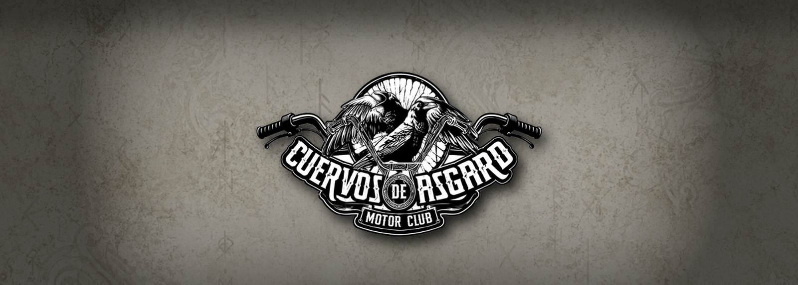
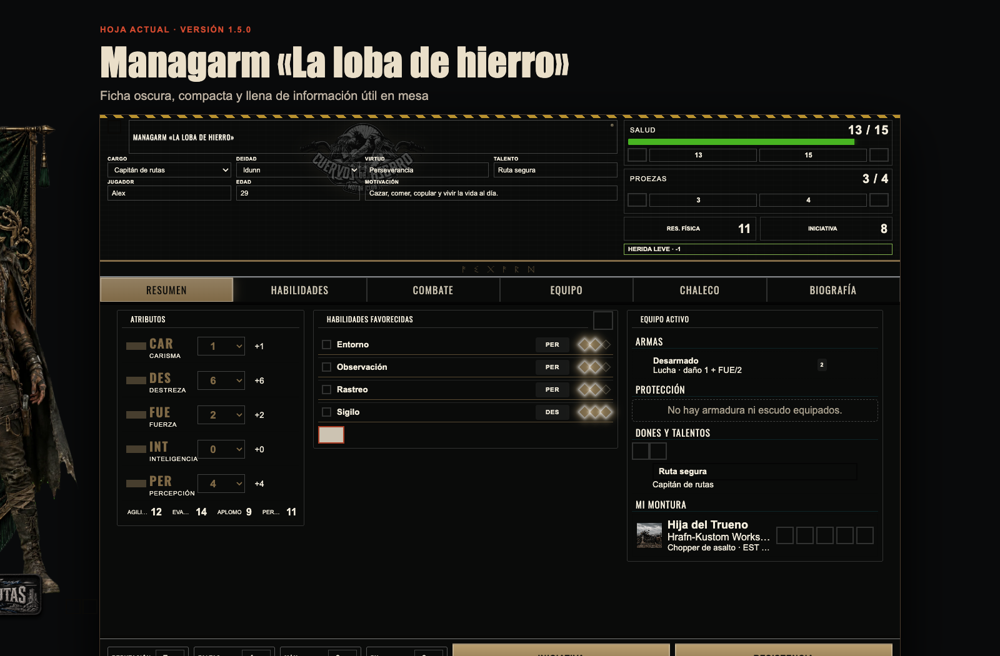
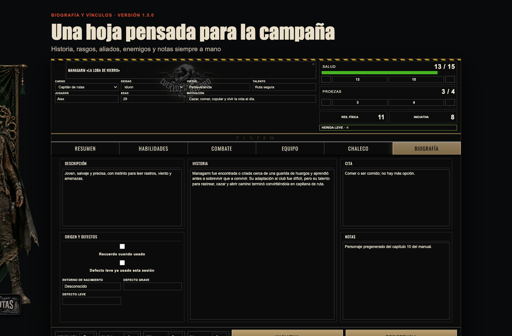
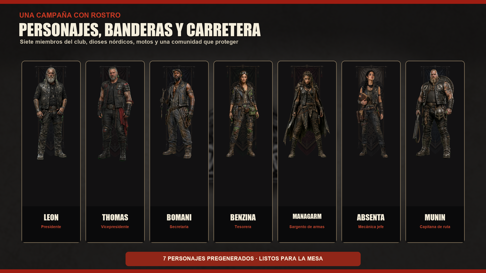
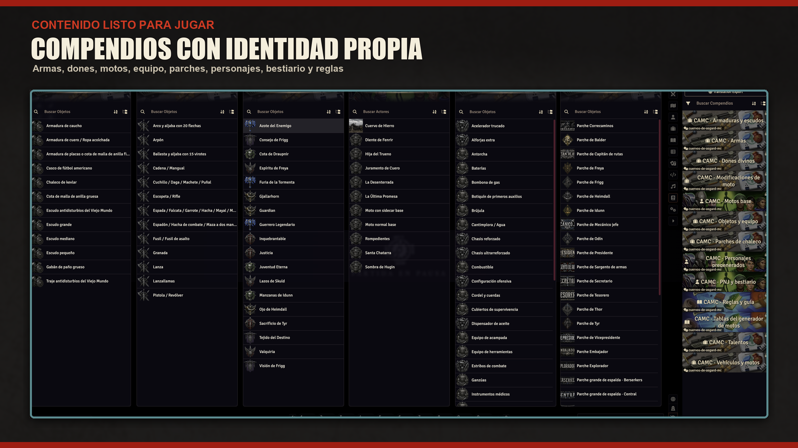

<p align="center">
  
</p>

# Cuervos de Asgard Motor Club para Foundry VTT

<p align="center">
  <a href="https://github.com/ManuRomera/cuervos-de-asgard-mc/releases/latest"></a>
  <a href="https://foundryvtt.com"></a>
  <a href="https://github.com/ManuRomera/cuervos-de-asgard-mc/releases"></a>
  
  <a href="LICENSE"></a>
</p>

> **WIP / Work in Progress.** Este sistema está en desarrollo activo. Ya es usable en mesa, pero las hojas, automatizaciones, generadores y compendios pueden cambiar entre versiones mientras se completa y se revisa contra el manual.

Sistema no oficial para jugar **Cuervos de Asgard Motor Club** en Foundry VTT v13 y v14. Implementa hojas nativas, tiradas y automatizaciones sobre una base Ysystem adaptada a carretera postapocalíptica, comunidad, motos, dones divinos y parches de chaleco.

## Vista rápida









## Juego premiado

**Cuervos de Asgard Motor Club** fue galardonado como **Mejor juego de rol original en castellano en los Premios HazRol 2025**, según anunció Walhalla Ediciones: https://walhallaediciones.com/cuervos-de-asgard-premios-hazrol-2025

## Instalación directa

En Foundry VTT ve a **Configuración → Sistemas de juego → Instalar sistema** y pega esta URL en **URL del Manifiesto**:

```text
https://raw.githubusercontent.com/ManuRomera/cuervos-de-asgard-mc/main/system.json
```

Foundry descargará el sistema desde la última release y avisará cuando haya actualizaciones.

## Qué incluye

- **Tutorial del sistema** en doce capítulos con ejercicios: se ofrece al entrar por primera vez y está en el botón «Tutorial» de la pestaña de Actores.

- Hoja de `personaje` con cabecera temática, retrato o figura exterior, deidad, cargo, parches, recursos, atributos, valores derivados, habilidades, combate, equipo, dones, moto vinculada y biografía.
- Hoja de `pnj` rápida para mesa, con atributos, valores derivados, habilidades relevantes, ataque, acción especial, salud y notas.
- Hoja de `comunidad` con las reglas del capítulo 7: Moral, Población y Recursos, capítulo y capacidad especial, Mesa presidencial, enemigo jurado y tabla de sucesos (D66) con tirada de salvación.
- Hoja de `moto` con estructura, daño, maniobrabilidad, carga, modificaciones, acciones de conducción, tuneado y generador.
- Hoja de `item` para armas, armaduras, escudos, dones, objetos, vehículos, talentos y reglas.
- Chat cards temáticas para tiradas, daño, iniciativa, dones, armas y acciones de vehículo.
- Diseño compacto opcional y calibración visual de parches sobre el chaleco.

## Automatizaciones

- **Tiradas** de habilidad con todos los modificadores del manual (armadura y escudo, falta de luz, cobertura, ráfagas, acciones combinadas, talentos), críticos y pifias, proezas (repetir dados, +1D, subir valores pasivos) y Recuerdo cuando….
- **Defectos** activados por el DJ y repetición con proeza; si la repetición acierta, se calcula el daño.
- **Combate**: iniciativa con los desempates del manual, daño por arma (fijo + atributo), apuntar, noquear, críticos, proezas en el daño (+1D que explota), munición y cargador vacío en ráfagas, aplicar daño con la armadura del objetivo.
- **Salud**: penalizadores de −1D y −2D, Resistencia Física automática al bajar de 11, 7, 4 y 2 (con desmayo), curación con Auxilio.
- **Ficha derivada**: Agilidad, Evasión, Aplomo, Perspicacia, Salud, Resistencia Física, proezas y protección se calculan solas; carga a pie y en alforjas; modificaciones de moto.
- **Persecuciones**: terreno, visibilidad, acciones de movimiento y las ocho maniobras con sus modificadores, estructura y daño de la moto.
- **Campaña**: «Nueva sesión» y «Fin de aventura» (Experiencia, caducidad de objetos reciclados, suceso de comunidad), Reputación con rangos, Faltas, Experiencia con los costes del manual.
- **Comunidad**: efectos en cascada de Moral, Población y Recursos, y sucesos con salvación.
- **Creación**: asistente guiado paso a paso, generador aleatorio completo de PJ (equipo del cargo, talento, don, moto), de PNJ, de comunidad y de montura.
- Las hojas recuerdan posición, tamaño y pestaña. Importador de contenido al mundo, configurable.

## Compendios y contenido

El sistema incluye compendios para:

- Armas.
- Armaduras y escudos.
- Dones divinos.
- Talentos.
- Objetos y equipo.
- Parches de chaleco.
- Vehículos y motos.
- Motos base.
- Modificaciones de moto.
- Tablas del generador de motos.
- Personajes pregenerados.
- PNJ y bestiario.
- Reglas y guía.

Además conserva datos fuente estructurados en `_data/` para regenerar o importar contenido: armas, armaduras, bestiario, dones, manual, motos, objetos, parches, personajes, talentos, vehículos y escenas.

## Ajustes del sistema

- `Importar contenido automáticamente`: crea contenido de mundo desde los datos integrados.
- `Hojas compactas`: reduce espacio visual en pantalla.
- `PJ · Modo de imagen`: retrato integrado o figura exterior con fondo de deidad o bandera genérica.
- `PJ · Tamaño de figura exterior`: escala global de la figura exterior de PJ.
- `PJ · Tamaño de bandera`: escala global de la bandera de fondo de PJ.
- `PNJ · Modo de imagen`: retrato integrado o figura exterior con bandera propia.
- `PNJ · Tamaño de figura exterior`: escala global de la figura exterior de PNJ.
- `PNJ · Tamaño de bandera`: escala global de la bandera de fondo de PNJ.
- `Calibrar posiciones del chaleco`: herramienta de DJ para ajustar coordenadas y tamaño de parches.

## Compatibilidad

| Versión del sistema | Foundry VTT mínimo | Foundry VTT verificado |
|---|---|---|
| 1.5.0 WIP | v13 | v13.351 |

Capa compartida de compatibilidad V13/V14: APIs con namespace, registro de fichas, normalización del chat y visibilidad de tiradas adaptada a cada generación. V14 pendiente de prueba real; `verified` conserva el valor histórico 13.351 y no certifica esta nueva versión. Consulta [las pruebas pendientes](docs/compatibility.md).

## Autoría y comunidad

Sistema desarrollado por **Manu Romera**, miembro de **Bruma's Rol**.

Bruma's Rol es un grupo de personas que vive el rol con auténtica pasión: cada historia, cada partida, cada campaña y cada sesión se comparte, se discute y se transforma en nuevas ideas. Muchas de las propuestas que nacen en esa mesa acaban convirtiéndose en aventuras, campañas, sistemas, automatizaciones o pequeños arreglos pensados para que jugar sea más ágil, más bonito y más emocionante.

Reconocimiento especial a **Jubilados de Arkham**, colaborador inestimable del proyecto. Aunque no forma parte de Bruma's Rol, ha probado cada variante del sistema hasta llegar al estado actual, revisando reglas, detectando huecos y empujando muchas de las mejoras que han terminado incorporándose. Su trabajo de testeo y su cariño por **Cuervos de Asgard Motor Club** se notan en cada ajuste.

## Repositorio y releases

- Repositorio: https://github.com/ManuRomera/cuervos-de-asgard-mc
- Releases: https://github.com/ManuRomera/cuervos-de-asgard-mc/releases
- Manifest: https://raw.githubusercontent.com/ManuRomera/cuervos-de-asgard-mc/main/system.json

## Aviso

Este paquete es una implementación no oficial para uso en Foundry VTT. Las reglas, nombres y elementos propios de la obra pertenecen a sus titulares correspondientes. El repositorio contiene código, hojas, datos estructurados y automatizaciones para facilitar el juego en mesa virtual.

El código, las imágenes y parte de los textos de apoyo de este repositorio han sido creados o asistidos mediante herramientas de inteligencia artificial, con revisión humana posterior antes de su publicación.

## Informar de un problema

Si encuentras un fallo, especialmente al usar Foundry V13 o V14, [abre una incidencia en GitHub](https://github.com/ManuRomera/cuervos-de-asgard-mc/issues/new/choose). El formulario pide las versiones exactas de Foundry y del sistema, los pasos para reproducirlo y qué esperabas que ocurriera. Puedes adjuntar capturas y errores de consola, y señalar si ocurre también sin módulos. Necesitas una cuenta de GitHub.
